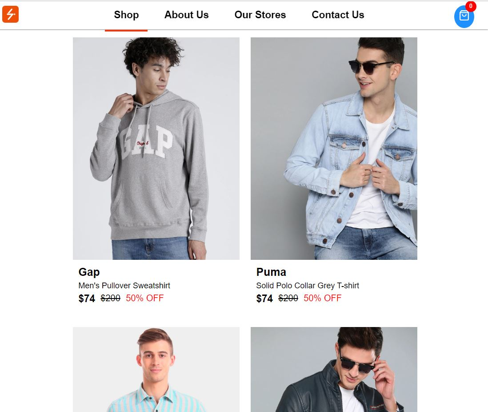

## How to run project locally

1. Download Code zip file and extract in a separate folder
2. Install dependencies using `npm install` command
3. Run `npm start` command in the project root directory to run the app.
4. App will run on [http://localhost:3000](http://localhost:3000)

## Features
1. Responsive - ✔️
2. Persist cart items - ✔️
3. Lazy Load Images - ✔️
4. Lazy loading and suspense - ✔️
5. Add Variants of products - ✔️
6. Editable cart - ✔️

## Missing Features 
1. Search Functionality - ❌
2. Filtering products - ❌
3. Responsive Navbar with burger menu and sidebar - ❌

## Hosted App
Live app -> https://ecommercetshirts.netlify.app 

## Demo Image - Rendered View

## Demo Image - Cart View

